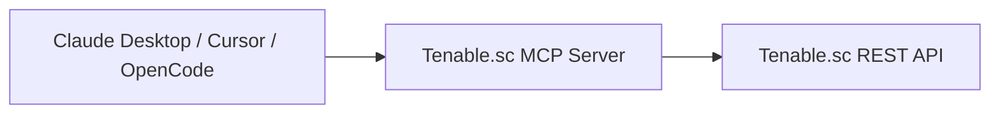

# Tenable.sc MCP Server

[]()
[]()
[]()

A Model Context Protocol (MCP) server for Tenable.sc that enables AI assistants like Claude Desktop, Cursor, OpenCode, and VS Code to securely interact with Tenable.sc through natural language.

This server exposes Tenable.sc functionality as MCP tools, allowing AI clients to:

- Query vulnerabilities and assets
- Launch and manage scans
- Run analysis queries
- Retrieve repositories and reports
- Automate Tenable.sc workflows

Supports both:

- `stdio` transport for local desktop MCP clients
- `streamable-http` transport for remote/shared deployments

---

## Features

- Full MCP-compatible server
- Docker and Docker Compose support
- Local (`stdio`) and remote (`streamable-http`) transports
- Generic REST passthrough support
- Multi-instance deployment support
- Environment variable configuration
- SSL verification controls
- Compatible with modern MCP clients

---

## Architecture



---

# Quick Start

## 1. Create `.env`

```env
SC_HOST=https://securitycenter.example.com
SC_USERNAME=svc_mcp
SC_PASSWORD=super-secret-password

SC_PORT=443
SC_VERIFY_SSL=true

MCP_PORT=8080

LOG_LEVEL=INFO
```

---

<details>
<summary><strong>Docker Compose Quickstart</strong></summary>

### docker-compose.yml

```yaml
services:
  tenable-sc-mcp:
    image: ghcr.io/sparksbenjamin/tenable.sc-mcp:latest
    container_name: tenable-sc-mcp

    restart: unless-stopped

    ports:
      - "${MCP_PORT:-8080}:${MCP_PORT:-8080}"

    environment:
      SC_HOST: ${SC_HOST}
      SC_USERNAME: ${SC_USERNAME}
      SC_PASSWORD: ${SC_PASSWORD}
      SC_PORT: ${SC_PORT:-443}
      SC_VERIFY_SSL: ${SC_VERIFY_SSL:-true}

      MCP_HOST: 0.0.0.0
      MCP_PORT: ${MCP_PORT:-8080}

      LOG_LEVEL: ${LOG_LEVEL:-INFO}
```

### Start

```bash
docker compose up -d
```

### MCP Endpoint

```text
http://localhost:8080/mcp
```

</details>

---

## MCP Client Configuration

### Remote MCP

```json
{
  "mcp": {
    "tenable-sc": {
      "type": "remote",
      "url": "http://localhost:8080/mcp"
    }
  }
}
```

---

## Local Development

### Clone Repository

```bash
git clone https://github.com/sparksbenjamin/tenable.sc-mcp.git
cd tenable.sc-mcp
```

---

### Create Virtual Environment

```bash
python3 -m venv .venv
source .venv/bin/activate
```

---

### Install Dependencies

```bash
pip install -r requirements.txt
```

---

### Run Locally

```bash
python -m tenable_sc_mcp \
  --transport streamable-http \
  --host 0.0.0.0 \
  --port 8080 \
  --allow-remote-hosts
```

---

### Local Docker Development

Use a local source build instead of the published image:

```yaml
services:
  tenable-sc-mcp:
    build: .
    container_name: tenable-sc-mcp

    restart: unless-stopped

    ports:
      - "${MCP_PORT:-8080}:${MCP_PORT:-8080}"

    environment:
      SC_HOST: ${SC_HOST}
      SC_USERNAME: ${SC_USERNAME}
      SC_PASSWORD: ${SC_PASSWORD}
      SC_PORT: ${SC_PORT:-443}
      SC_VERIFY_SSL: ${SC_VERIFY_SSL:-true}

      MCP_HOST: 0.0.0.0
      MCP_PORT: ${MCP_PORT:-8080}

      LOG_LEVEL: ${LOG_LEVEL:-INFO}
```

Run:

```bash
docker compose up -d --build
```

---

## Available MCP Tools

| Tool | Description |
|---|---|
| `tsc_current_user` | Return authenticated Tenable.sc identity |
| `tsc_list` | List objects from a resource |
| `tsc_get` | Retrieve a specific object |
| `tsc_create` | Create supported resources |
| `tsc_update` | Update existing resources |
| `tsc_delete` | Delete resources |
| `tsc_analyze` | Execute analysis queries |
| `tsc_download` | Download reports and exports |
| `tsc_upload_file` | Upload files |
| `tsc_request` | Generic REST API passthrough |

---

## Example Prompts

```text
Show me critical vulnerabilities discovered in the last 7 days
```

```text
List all repositories and their IDs
```

```text
Launch the weekly external scan
```

```text
Show me the top vulnerable assets by severity
```

---

## Security Notes

> [!WARNING]
> This MCP server inherits the permissions of the configured Tenable.sc API user.
> Use a dedicated least-privilege service account.

> [!CAUTION]
> Remote HTTP mode does not provide built-in authentication.
> Restrict access using VPNs, reverse proxies, firewalls, or SSH tunnels.

---

## Troubleshooting

### SSL Errors

For lab or self-signed environments:

```env
SC_VERIFY_SSL=false
```

---

### Browser Access Errors

Opening `/mcp` directly in a browser may show protocol errors.

This is expected — the endpoint is intended for MCP-compatible clients.

---

## Roadmap

- OAuth support
- Tool-level RBAC filtering
- Enhanced schema discovery
- Streaming analysis queries
- Audit logging improvements
- Additional MCP resources

---

## License

GPLv3
